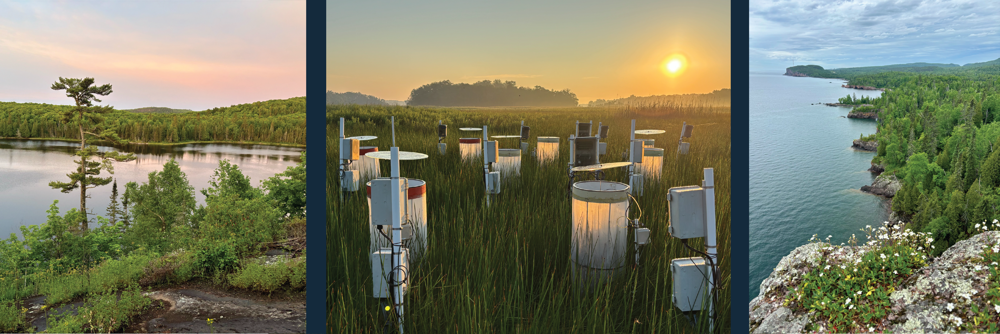
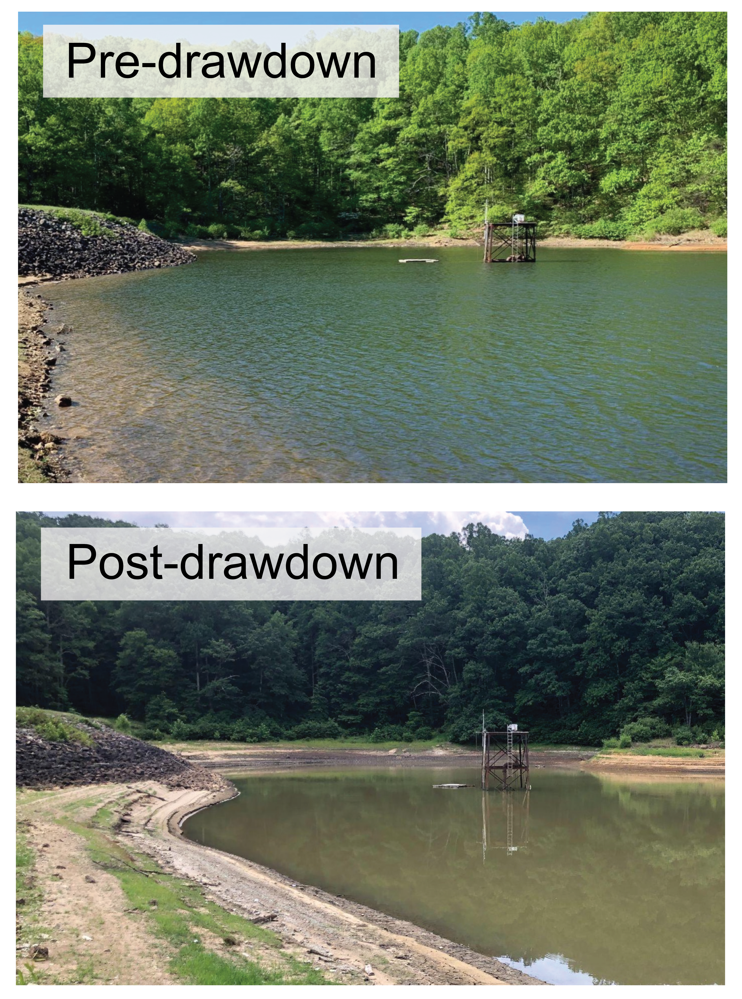

---
title: "Current Research"
description: "Research areas for Abigail (Abby) Lewis"
title-block-style: none
---

{style="width:100%; alt:'a lake, autmoated flux chambers, and another lakeshore'"}

My research aims to understand and predict changes in aquatic ecosystem function worldwide. I work in a range of ecosystems from freshwater lakes to coastal wetlands, and I employ diverse methods including whole-ecosystem experiments, global data analysis, and ecological forecasting. 

Below are several active research areas:

## Ecological forecasting

Can we forecast ecology like we forecast the weather? Ecological forecasts are transformative for environmental management because they allow us to prepare for environmental threats before they happen. However, some ecological variables seem to be more predictable than others. I am working to understand where and when forecasts succeed vs. fail so we can make better predictions in the future.

Select publications:
<ul>
<li>Lewis et al. 2026, <a href="https://doi.org/10.1002/ecs2.70647" target="_blank"><i>Ecosphere</i></a></li>
<li>Olsson et al. 2025, <a href="https://doi.org/10.1002/eap.70004" target="_blank"><i>Ecological Applications</i></a></li>
<li>Lewis et al. 2023, <a href="https://doi.org/10.1111/2041-210X.13955" target="_blank"><i>Methods in Ecology and Evolution</i></a></li>
<li>Thomas et al. 2023, <a href="https://doi.org/10.1002/fee.2616" target="_blank"><i>Frontiers in Ecology and the Environment</i></a></li>
<li>Lewis et al. 2022, <a href="https://doi.org/10.1002/eap.2500" target="_blank"><i>Ecological Applications</i></a></li>
<li>Carey et al. 2021, <a href="https://doi.org/10.1080/20442041.2020.1816421" target="_blank"><i>Inland Waters</i></a></li>
</ul>

## Aquatic carbon cycling

{style="float:right; padding-right:10px; width:200px; alt:'Image of the reservoir before and after water level drawdown, which made water quality visibly worse'"}

Aquatic ecosystems play an important role in the global carbon cycling processes that regulate Earth's climate. However, anthropogenic changes can modulate the way these ecosystems process carbon, leading to positive or negative climate feedback effects. I use experiments and monitoring to analyze the effects of anthropogenic drivers on the biogeochemistry of carbon in aquatic environments. 

Select publications:
<ul>
<li>Hounshell et al. 2026, <a href="https://doi.org/10.1007/s00027-025-01252-5" target="_blank"><i>Aquatic Sciences</i></a></li>
<li>Lewis et al. 2024, <a href="https://doi.org/10.1029/2023JG007780" target="_blank"><i>JGR Biogeosciences</i></a></li>
<li>Howard et al. 2024, <a href="https://doi.org/10.1029/2024JG008057" target="_blank"><i>JGR Biogeosciences</i></a></li>
<li>Lewis et al. 2023, <a href="https://doi.org/10.1029/2022JG007071" target="_blank"><i>JGR Biogeosciences</i></a></li>
<li>Woelmer et al. 2023, <a href="https://doi.org/10.1007/s00027-023-00959-7" target="_blank"><i>Aquatic Sciences</i></a></li>
<li>Carey et al. 2022, <a href="https://doi.org/10.1111/gcb.16228" target="_blank"><i>Global Change Biology</i></a></li>
<ul/>

## Large-scale limnology

Not all lakes respond to anthropogenic pressures in the same way. Large-scale data analyses are needed to predict changes in lake ecosystem function worldwide and prioritize management efforts. I work closely with members of the <a href="https://gleon.org/" target="_blank">Global Lake Ecological Observatory Network</a> to analyze patterns of ecosystem function in lakes worldwide and how these functions may change over time. 

Select publications:
<ul>
<li>Lewis et al. 2026, <a href="https://doi.org/10.1002/lol2.70116" target="_blank"><i>Limnology and Oceanography Letters</i></a></li> 
<li>Rabaey et al. 2026, <a href="https://doi.org/10.1038/s41597-026-06751-0" target="_blank"><i>Scientific Data</i></a></li>
<li>Lewis et al. 2025, <a href="https://doi.org/10.1111/ele.70243" target="_blank"><i>Ecology Letters</i></a></li>
<li>Lewis et al. 2024, <a href="http://doi.org/10.1111/gcb.17046" target="_blank"><i>Global Change Biology</i></a></li>
<li>Jane et al. 2022, <a href="https://doi.org/10.1111/gcb.16525" target="_blank"><i>Global Change Biology</i></a></li>
<li>Lewis et al. 2020, <a href="https://doi.org/10.1080/20442041.2019.1664233" target="_blank"><i>Inland Waters</i></a></li>
</ul>

## Science Outreach and Teaching

I really enjoy science outreach and teaching, and I integrate <a href="https://abbylewis.github.io/teaching.html" target="_blank">Outreach and Teaching</a> with research to increase the impact of my work.

Select publications:
<ul>
<li>Lewis et al. 2023, <a href="https://doi.org/10.15695/jstem/v6i1.14" target="_blank"><i>Journal of STEM Outreach</i></a></li>
<li>Lewis et al. 2023, <a href="https://doi.org/10.25334/5D99-Y019" target="_blank"><i>Teaching Issues and Experiments in Ecology</i></a></li>
</ul>
 
 